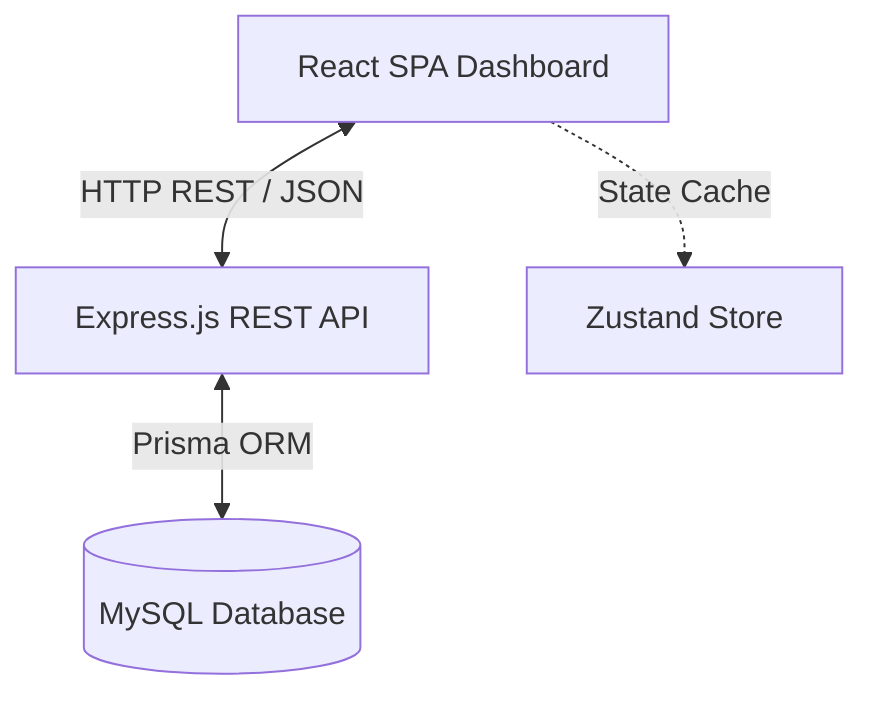
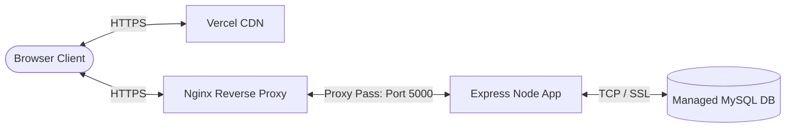

# RescueHub Server Documentation & Integration Guide

This guide documents the target architecture, database schema, REST API, deployment, and setup instructions for the **RescueHub Backend Service**.

---

## 1. System Architecture

The transition from a local-only prototype to a client-server architecture utilizes a decoupled **Model-View-Controller (MVC)** service pattern.



---

## 2. Deployment Diagram

For production deployment, the frontend client is served via a CDN (e.g., Vercel / Netlify), communicating over HTTPS with the Node.js API server hosted behind a reverse proxy (e.g., Nginx) on an application container host.



---

## 3. Database Schema

The database is built on **MySQL 8.0** and managed using **Prisma ORM**. Below is the DDL representation generated for production databases.

```sql
-- Create Species Table
CREATE TABLE `Species` (
    `id` INTEGER NOT NULL AUTO_INCREMENT,
    `species_name` VARCHAR(100) NOT NULL,
    UNIQUE INDEX `Species_species_name_key`(`species_name`),
    PRIMARY KEY (`id`)
) DEFAULT CHARACTER SET utf8mb4 COLLATE utf8mb4_unicode_ci;

-- Create Role Table
CREATE TABLE `Role` (
    `id` INTEGER NOT NULL AUTO_INCREMENT,
    `role_name` VARCHAR(100) NOT NULL,
    UNIQUE INDEX `Role_role_name_key`(`role_name`),
    PRIMARY KEY (`id`)
) DEFAULT CHARACTER SET utf8mb4 COLLATE utf8mb4_unicode_ci;

-- Create Shelter Table
CREATE TABLE `Shelter` (
    `id` INTEGER NOT NULL AUTO_INCREMENT,
    `shelter_name` VARCHAR(100) NOT NULL,
    `capacity` INTEGER NOT NULL,
    `address` VARCHAR(255) NOT NULL,
    `contact_number` VARCHAR(100) NOT NULL,
    `created_at` DATETIME(3) NOT NULL DEFAULT CURRENT_TIMESTAMP(3),
    PRIMARY KEY (`id`)
) DEFAULT CHARACTER SET utf8mb4 COLLATE utf8mb4_unicode_ci;

-- Create Team Table
CREATE TABLE `Team` (
    `id` INTEGER NOT NULL AUTO_INCREMENT,
    `team_name` VARCHAR(100) NOT NULL,
    `manager_agent_id` INTEGER NULL,
    `base_shelter_id` INTEGER NOT NULL,
    PRIMARY KEY (`id`)
) DEFAULT CHARACTER SET utf8mb4 COLLATE utf8mb4_unicode_ci;

-- Create Agent Table
CREATE TABLE `Agent` (
    `id` INTEGER NOT NULL AUTO_INCREMENT,
    `first_name` VARCHAR(100) NOT NULL,
    `last_name` VARCHAR(100) NOT NULL,
    `email` VARCHAR(255) NOT NULL,
    `password` VARCHAR(255) NOT NULL,
    `phone` VARCHAR(100) NOT NULL,
    `team_id` INTEGER NULL,
    `role_id` INTEGER NOT NULL,
    `status` VARCHAR(50) NOT NULL DEFAULT 'Active',
    UNIQUE INDEX `Agent_email_key`(`email`),
    PRIMARY KEY (`id`)
) DEFAULT CHARACTER SET utf8mb4 COLLATE utf8mb4_unicode_ci;

-- Create Incident_Report Table
CREATE TABLE `Incident_Report` (
    `id` INTEGER NOT NULL AUTO_INCREMENT,
    `reporter_name` VARCHAR(100) NULL,
    `contact_number` VARCHAR(100) NULL,
    `is_anonymous` BOOLEAN NOT NULL DEFAULT false,
    `species_id` INTEGER NOT NULL,
    `severity` VARCHAR(50) NOT NULL,
    `status` VARCHAR(50) NOT NULL DEFAULT 'Pending',
    `latitude` DOUBLE NOT NULL,
    `longitude` DOUBLE NOT NULL,
    `photo` VARCHAR(255) NULL,
    `description` TEXT NOT NULL,
    `created_at` DATETIME(3) NOT NULL DEFAULT CURRENT_TIMESTAMP(3),
    PRIMARY KEY (`id`)
) DEFAULT CHARACTER SET utf8mb4 COLLATE utf8mb4_unicode_ci;

-- Create Ticket Table
CREATE TABLE `Ticket` (
    `id` INTEGER NOT NULL AUTO_INCREMENT,
    `subject` VARCHAR(255) NOT NULL,
    `incident_report_id` INTEGER NULL,
    `rescue_date` DATETIME(3) NULL,
    `resolution_time` DATETIME(3) NULL,
    `rescue_notes` TEXT NOT NULL,
    `raised_by` VARCHAR(255) NULL,
    `status` VARCHAR(50) NOT NULL DEFAULT 'REPORTED',
    `priority` VARCHAR(50) NOT NULL,
    `current_assigned_team_id` INTEGER NULL,
    `description` TEXT NOT NULL,
    `created_at` DATETIME(3) NOT NULL DEFAULT CURRENT_TIMESTAMP(3),
    PRIMARY KEY (`id`)
) DEFAULT CHARACTER SET utf8mb4 COLLATE utf8mb4_unicode_ci;

-- Create Animal Table
CREATE TABLE `Animal` (
    `id` INTEGER NOT NULL AUTO_INCREMENT,
    `name` VARCHAR(100) NOT NULL,
    `species_id` INTEGER NOT NULL,
    `breed` VARCHAR(100) NULL,
    `sex` VARCHAR(50) NOT NULL,
    `age_estimate` VARCHAR(50) NOT NULL,
    `weight` DOUBLE NOT NULL,
    `condition` TEXT NOT NULL,
    `status` VARCHAR(50) NOT NULL,
    `photo_url` VARCHAR(255) NULL,
    `ticket_id` INTEGER NULL,
    `shelter_id` INTEGER NULL,
    `created_at` DATETIME(3) NOT NULL DEFAULT CURRENT_TIMESTAMP(3),
    PRIMARY KEY (`id`)
) DEFAULT CHARACTER SET utf8mb4 COLLATE utf8mb4_unicode_ci;

-- Create Animal_Treatment Table
CREATE TABLE `Animal_Treatment` (
    `id` INTEGER NOT NULL AUTO_INCREMENT,
    `animal_id` INTEGER NOT NULL,
    `vet_agent_id` INTEGER NOT NULL,
    `ticket_id` INTEGER NULL,
    `followup_date` DATETIME(3) NULL,
    `diagnosis` TEXT NOT NULL,
    `treatment` TEXT NOT NULL,
    `medication` TEXT NOT NULL,
    `notes` TEXT NOT NULL,
    `created_at` DATETIME(3) NOT NULL DEFAULT CURRENT_TIMESTAMP(3),
    PRIMARY KEY (`id`)
) DEFAULT CHARACTER SET utf8mb4 COLLATE utf8mb4_unicode_ci;

-- Add Foreign Key Constraints
ALTER TABLE `Team` ADD CONSTRAINT `Team_manager_agent_id_fkey` FOREIGN KEY (`manager_agent_id`) REFERENCES `Agent`(`id`) ON DELETE SET NULL ON UPDATE CASCADE;
ALTER TABLE `Team` ADD CONSTRAINT `Team_base_shelter_id_fkey` FOREIGN KEY (`base_shelter_id`) REFERENCES `Shelter`(`id`) ON DELETE RESTRICT ON UPDATE CASCADE;
ALTER TABLE `Agent` ADD CONSTRAINT `Agent_team_id_fkey` FOREIGN KEY (`team_id`) REFERENCES `Team`(`id`) ON DELETE SET NULL ON UPDATE CASCADE;
ALTER TABLE `Agent` ADD CONSTRAINT `Agent_role_id_fkey` FOREIGN KEY (`role_id`) REFERENCES `Role`(`id`) ON DELETE RESTRICT ON UPDATE CASCADE;
ALTER TABLE `Incident_Report` ADD CONSTRAINT `Incident_Report_species_id_fkey` FOREIGN KEY (`species_id`) REFERENCES `Species`(`id`) ON DELETE RESTRICT ON UPDATE CASCADE;
ALTER TABLE `Ticket` ADD CONSTRAINT `Ticket_incident_report_id_fkey` FOREIGN KEY (`incident_report_id`) REFERENCES `Incident_Report`(`id`) ON DELETE SET NULL ON UPDATE CASCADE;
ALTER TABLE `Ticket` ADD CONSTRAINT `Ticket_current_assigned_team_id_fkey` FOREIGN KEY (`current_assigned_team_id`) REFERENCES `Team`(`id`) ON DELETE SET NULL ON UPDATE CASCADE;
ALTER TABLE `Animal` ADD CONSTRAINT `Animal_species_id_fkey` FOREIGN KEY (`species_id`) REFERENCES `Species`(`id`) ON DELETE RESTRICT ON UPDATE CASCADE;
ALTER TABLE `Animal` ADD CONSTRAINT `Animal_ticket_id_fkey` FOREIGN KEY (`ticket_id`) REFERENCES `Ticket`(`id`) ON DELETE SET NULL ON UPDATE CASCADE;
ALTER TABLE `Animal` ADD CONSTRAINT `Animal_shelter_id_fkey` FOREIGN KEY (`shelter_id`) REFERENCES `Shelter`(`id`) ON DELETE SET NULL ON UPDATE CASCADE;
ALTER TABLE `Animal_Treatment` ADD CONSTRAINT `Animal_Treatment_animal_id_fkey` FOREIGN KEY (`animal_id`) REFERENCES `Animal`(`id`) ON DELETE CASCADE ON UPDATE CASCADE;
ALTER TABLE `Animal_Treatment` ADD CONSTRAINT `Animal_Treatment_vet_agent_id_fkey` FOREIGN KEY (`vet_agent_id`) REFERENCES `Agent`(`id`) ON DELETE RESTRICT ON UPDATE CASCADE;
ALTER TABLE `Animal_Treatment` ADD CONSTRAINT `Animal_Treatment_ticket_id_fkey` FOREIGN KEY (`ticket_id`) REFERENCES `Ticket`(`id`) ON DELETE SET NULL ON UPDATE CASCADE;
```

---

## 4. API Documentation

### Auth Module
* `POST /api/auth/register`: Create user agent profile.
* `POST /api/auth/login`: Authenticate and receive JWT credentials.
* `GET /api/auth/me`: Get profile of authenticated agent session.

### Incident Reports Module
* `GET /api/incidents`: Fetch all recorded incident reports.
* `POST /api/incidents`: Submit a new public incident report.
* `PUT /api/incidents/:id`: Update report status/details.
* `POST /api/incidents/:id/promote`: Promote an incident report to an active case/ticket.

### Tickets (Rescue Cases) Module
* `GET /api/tickets`: List active cases.
* `POST /api/tickets`: Spawn a new case manually.
* `PUT /api/tickets/:id`: Update case properties (status transitions are validated).
* `DELETE /api/tickets/:id`: Remove a case record.

### Animals Module
* `GET /api/animals`: Get animal profiles.
* `POST /api/animals`: Register new rescued animal.
* `PUT /api/animals/:id`: Update animal details.

### Shelters Module
* `GET /api/shelters`: List shelters and active bed spaces.
* `POST /api/shelters`: Register shelter location.

---

## 5. Installation Guide

### Prerequisites
* **Node.js** (v18+)
* **MySQL Server** (v8.0+)

### Setup Steps
1. Navigate to `/server` folder:
   ```bash
   cd server
   ```
2. Install project dependencies:
   ```bash
   npm install
   ```
3. Set up environment variables:
   ```bash
   cp .env.example .env
   ```
   *Edit `.env` and set `DATABASE_URL` with your local MySQL credentials.*
4. Initialize database, apply migrations, and generate Prisma client:
   ```bash
   npx prisma db push
   ```
5. Seed database with mockup data:
   ```bash
   npm run prisma:seed
   ```
6. Run the backend service:
   ```bash
   npm run dev
   ```
   *Server boots up on http://localhost:5000.*
